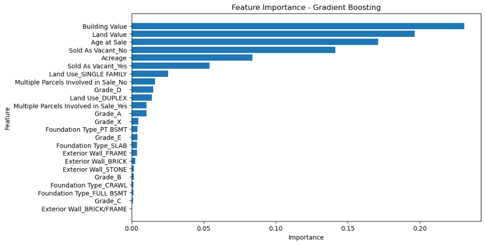

Nashville Housing Prediction

Pratik Amol Halurkar

Module 4 assignment

ALY6020: Predictive Analytics (CRN: 20356)

Prof. Justin Grosz

3/17/2024

# Introduction

In this assignment, we will analyze a housing sales dataset to assist
our company in gaining insights into the Nashville area, as the company
is planning a significant investment in the region. Our task is to help
the company understand the factors influencing sales prices compared to
value, which is a critical variable indicating whether properties are
overvalued or undervalued. Using data analytics techniques, we will
explore the dataset, build multiple models, and recommend the most
suitable model for predicting the status of properties.

# Data cleaning and preprocessing

The initial step in our analysis involves exploring the dataset,
examining each variable to understand its significance within the
records. Upon importing the dataset using the pandas library, an initial
inspection reveals 26 columns. Among these, some are categorical
variables while others are quantitative. Notably, the categorical
variables contain numerous categories, suggesting the potential for
model performance degradation if all categories are retained.

Our dataset comprises 22,651 observations and 26 columns, encompassing
15 object, 5 integer, and 6 float data types. To streamline our analysis
and focus on relevant information, several variables such as 'Unnamed:
0', 'Parcel ID', 'Suite/ Condo \#', 'Legal Reference', and 'Property
Address' have been removed. These variables either serve as identifiers
or hold minimal relevance to our analytical goal. Additionally,
'Suite/condo \#' lacked observations and was consequently dropped.

Upon closer examination, it was observed that both 'Property city' and
'city' variables contain identical information. Given that Nashville is
located in the state of Tennessee, the 'state' variable remains
constant. Consequently, 'Property city' and 'city' were deemed redundant
and were removed to ensure the efficiency of our model.

Feature engineering was applied to 'Sale Date' and 'Year built'
variables. 'Sale Date' was converted to a datetime datatype, from which
'Sale year' was derived. Utilizing this information, the 'Age at sale'
feature was computed by subtracting 'Sale year' from 'Year built',
following which 'Sale year' and 'Year built' were dropped from the
dataset.

After all the initial analysis we are left with 18 variables:

Upon examining null values within the dataset, it was observed that the
occurrence of missing data was minimal across several variables.
Specifically:

- Finished Area had 0.004 percent missing data, and to address this, the
  KNN imputer algorithm was employed. KNN imputation is renowned for its
  effectiveness in filling missing numerical values.

- Foundation Type exhibited 0.004 percent missing data. Given the
  negligible proportion of missing values and its categorical nature,
  the NA entries were simply dropped from consideration.

- Bedrooms showed 0.013 percent missing data. Employing the KNN imputer
  algorithm once again, the missing values were imputed to ensure the
  integrity of the data.

- Full bath experienced 0.004 percent missing data, and similar to other
  numerical variables, the KNN imputer was utilized for imputation.

- Half Bath recorded a slightly higher percentage of missing data at
  0.47 percent. Despite this, the KNN imputer algorithm was still deemed
  suitable for handling these missing numerical values effectively.

In addition to addressing missing values, the dataset was scrutinized
for duplicated rows, revealing the presence of 558 duplicated entries.
To maintain data integrity, these duplicated rows were promptly removed
from the dataset.

Outliers were found in some of the variables in quite a good amount.

These outliers were treated by capping them at the maximum value, which
was 2SD from the mean. Capping at 2SD is a balanced approach that
addresses outliers without overly aggressive trimming of the data, thus
preserving valuable information.

In the categorical variables some of the variables had lots of
categories but few of those categories has very few observation. I have
kept the below categories only this comprises of more than 80% of the
data of that variable. City variable was dropped as all the category was
left is Nashville due to which became a constant. A high number of
features can lead to increased model complexity, especially if many of
them are irrelevant or redundant. By dropping unnecessary features, we
simplify the model, making it easier to understand and interpret.

'City': \['NASHVILLE'\], 'Land Use' :\['SINGLE FAMILY','DUPLEX'\],

'Foundation Type': \['CRAWL', 'FULL BSMT', 'PT BSMT', 'SLAB'\],

'Exterior Wall': \['BRICK', 'FRAME', 'BRICK/FRAME', 'STONE'\],

Tax District': \['URBAN SERVICES DISTRICT','GENERAL SERVICES DISTRICT'\]

# Analysis

After completing the data preprocessing phase, we conducted exploratory
data analysis to gain insights into the dataset:

1.  The dependent variable, Sale Price compared to Value, is a binary
    categorical variable. Over 12,000 properties are observed as
    overvalued, while around 4,000 properties are considered
    undervalued. This indicates an imbalance in the dataset, which may
    need to be addressed during model training to ensure accurate
    predictions.

2.  The mean acreage of properties is approximately 0.33 acres, with a
    standard deviation of 0.18. This suggests that most properties in
    the dataset are relatively small, although there is some variability
    in land size among them.

3.  The mean land value is approximately \$46,490, with a standard
    deviation of \$32,366. Similarly, the mean building value is
    approximately \$146,977, with a standard deviation of \$75,049.
    These statistics provide insights into the typical value
    distribution of land and buildings within the dataset.

4.  The mean age of properties at the time of sale is approximately 56
    years, with a standard deviation of 24 years. This wide range of
    property ages indicates diversity within the dataset, which may
    influence market dynamics and investment opportunities. Analyzing
    the distribution of property ages can yield valuable insights for
    strategic decision-making.

5.  There appears to be a high correlation between building value and
    Finished Area, as well as Full Bath, suggesting that these variables
    are closely related. Additionally, a moderate correlation exists
    between land value and Bedrooms, building value, and Finished Area.
    Understanding these correlations can aid in identifying key factors
    influencing property values and guiding investment strategies.

6.  High variance inflation factor was between few variables:

>  alt="A screenshot of a cell phone Description automatically generated" />
>
> In the subsequent step, variables exhibiting a Variance Inflation
> Factor (VIF) greater than 10 were identified and subsequently removed
> from consideration. The rationale behind this action is to mitigate
> the presence of multicollinearity within the dataset, thereby
> enhancing the reliability and interpretability of our models.I have
> done VIF analysis only for logistic regression as all the tree based
> models are capable of feature selection on their own.

# Model Development

> For the analysis, we built four models: a logistic regression model,
> decision tree model, Random Forest model and Gradient Boost model.
> Before constructing the models, we performed two crucial tasks.
> Firstly, we selected the independent variables, and secondly, we split
> the data into training and testing sets. To train and test the model
> effectively, the dataset has been divided into a 80% training set and
> a 20% test set. This division ensures that there is sufficient data
> for training the model while also providing enough data for testing
> its performance. I have used one hot encoding for all the categorical
> variables in the dataset.

## Logistic Regression

> The logistic regression model was built using Sklearn library using
> the independent variables which choosed after the VIF analysis and the
> dependent variables.
>
> Results of the Model
>
>  alt="A screenshot of a computer screen Description automatically generated" />
>
> The logistic regression model correctly identified 26 instances of
> true positives (actual "Over" properties) and 2 instances of true
> negatives (actual "Under" properties). However, it incorrectly
> predicted 765 instances as positive (false positives) and 2463
> instances as negative (false negatives).
>
> The model achieved an accuracy of 76.44%, indicating that it correctly
> predicted the class for 76.44% of instances. For the "Over" class, the
> precision (proportion of correctly predicted "Over" instances out of
> all instances predicted as "Over") was 76%, suggesting that 76% of the
> instances predicted as "Over" are actually "Over" properties. The
> recall (true positive rate) for the "Over" class was 100%, indicating
> that all actual "Over" properties were correctly predicted by the
> model. For the "Under" class, the precision was 93%, implying that 93%
> of the instances predicted as "Under" are actually "Under" properties.
> However, the recall for the "Under" class was only 3%, suggesting that
> only 3% of actual "Under" properties are correctly predicted by the
> model. The F1-score, which is the harmonic mean of precision and
> recall, was 0.87 for the "Over" class and 0.06 for the "Under" class.

## Decision Tree

> The decision tree model was built using the Sklearn library but VIF
> analysis was not used here instead independent variables consists of
> 27 variables.
>
>  style="width:5.44761in;height:0.63795in" />
>
> And the dependent variable.
>
> Results of the Model
>
>  alt="A screenshot of a white screen Description automatically generated" />
>  alt="A blue squares with white numbers Description automatically generated" />
>
> The decision tree model correctly identified 587 instances of true
> positives (actual "Over" properties) and 195 instances of true
> negatives (actual "Under" properties). However, it incorrectly
> predicted 596 instances as positive (false positives) and 1878
> instances as negative (false negatives).
>
> The model achieved an accuracy of 63.67%, indicating that it correctly
> predicted the class for 63.67% of instances. For the "Over" class, the
> precision (proportion of correctly predicted "Over" instances out of
> all instances predicted as "Over") was 76%, suggesting that 76% of the
> instances predicted as "Over" are actually "Over" properties. The
> recall (true positive rate) for the "Over" class was also 76%,
> indicating that 76% of actual "Over" properties were correctly
> predicted by the model. For the "Under" class, the precision was 25%,
> implying that 25% of the instances predicted as "Under" are actually
> "Under" properties. The recall for the "Under" class was also 25%,
> suggesting that 25% of actual "Under" properties are correctly
> predicted by the model. The F1-score, which is the harmonic mean of
> precision and recall, was 0.76 for the "Over" class and 0.25 for the
> "Under" class.
>
>  style="width:5.23902in;height:2.38693in" />

Total number of features: 24

Rank 1: Feature: Building Value, Importance: 0.3087262701506038

Rank 2: Feature: Finished Area, Importance: 0.25205577067181

Rank 3: Feature: Acreage, Importance: 0.17406823600885923

Rank 4: Feature: Land Value, Importance: 0.10638637459411843

Rank 5: Feature: Age at Sale, Importance: 0.01854714197251353

Rank 6: Feature: Multiple Parcels Involved in Sale_No, Importance:
0.016310698173824904

Rank 7: Feature: Sold As Vacant_Yes, Importance: 0.016304146451977426

Rank 8: Feature: Foundation Type_FULL BSMT, Importance:
0.014642644052266326

Rank 9: Feature: Multiple Parcels Involved in Sale_Yes, Importance:
0.013409421040024102

Rank 10: Feature: Foundation Type_SLAB, Importance: 0.011730997794037147

The above tree map and the ranking show the top 10 variables for our
model.

Upon reviewing the provided results, it's evident that the logistic
regression model outperforms the decision tree model across various
metrics. The logistic regression model achieves a higher accuracy of
76.44%, whereas the decision tree model's accuracy is notably lower at
63.67%. Additionally, the logistic regression model demonstrates
superior precision, with a score of 92.86%, indicating its ability to
accurately classify instances as "Over" or "Under." In contrast, the
decision tree model exhibits a precision of only 24.94%, suggesting a
higher rate of misclassification. Although the recall values for both
models are relatively low, the logistic regression model achieves a
slightly higher recall of 3.29% compared to the decision tree model's
recall of 24.65%. Overall, the logistic regression model demonstrates
better performance in accurately predicting property classifications
compared to the decision tree model, making it the preferred choice for
this task.

## Random Forest

The random forest model correctly identified 246 instances of true
positives (actual "Over" properties) and 100 instances of true negatives
(actual "Under" properties). However, it incorrectly predicted 691
instances as positive (false positives) and 2219 instances as negative
(false negatives).

The model achieved an accuracy of 71.22%, indicating that it correctly
predicted the class for 71.22% of instances. For the "Over" class, the
precision (proportion of correctly predicted "Over" instances out of all
instances predicted as "Over") was 76%, suggesting that 76% of the
instances predicted as "Over" are actually "Over" properties. The recall
(true positive rate) for the "Over" class was 90%, indicating that 90%
of actual "Over" properties were correctly predicted by the model.

For the "Under" class, the precision was 29%, implying that 29% of the
instances predicted as "Under" are actually "Under" properties. The
recall for the "Under" class was 13%, suggesting that only 13% of actual
"Under" properties are correctly predicted by the model. The F1-score,
which is the harmonic mean of precision and recall, was 0.83 for the
"Over" class and 0.18 for the "Under" class.

Upon analyzing the provided results, it's evident that the random forest
model outperforms the decision tree model across various performance
metrics. While the decision tree model achieves an accuracy of 63.67%,
the random forest model demonstrates a higher accuracy of 71.22%.
Additionally, the precision of the random forest model (28.90%)
surpasses that of the decision tree model (24.94%), indicating a better
ability to correctly classify instances as "Over" or "Under." Similarly,
the random forest model exhibits a higher recall of 12.64%, compared to
the decision tree model's recall of 24.65%, suggesting a greater
capability to capture instances of undervalued properties. Although both
models show limitations in accurately identifying undervalued
properties, the random forest model's overall performance is superior to
that of the decision tree model. Therefore, based on the provided
results, the random forest model emerges as the better choice for this
task, offering improved accuracy and predictive capabilities.

## Gradient Boosting

The gradient boosting model correctly identified 6 instances of true
positives (actual "Over" properties) and 33 instances of true negatives
(actual "Under" properties). However, it incorrectly predicted 758
instances as positive (false positives) and 2459 instances as negative
(false negatives).

The model achieved an accuracy of 76.54%, indicating that it correctly
predicted the class for 76.54% of instances. For the "Over" class, the
precision (proportion of correctly predicted "Over" instances out of all
instances predicted as "Over") was 76%, suggesting that 76% of the
instances predicted as "Over" are actually "Over" properties. The recall
(true positive rate) for the "Over" class was 100%, indicating that all
actual "Over" properties were correctly predicted by the model. For the
"Under" class, the precision was 85%, implying that 85% of the instances
predicted as "Under" are actually "Under" properties. The recall for the
"Under" class was 4%, suggesting that only 4% of actual "Under"
properties are correctly predicted by the model. The F1-score, which is
the harmonic mean of precision and recall, was 0.87 for the "Over" class
and 0.08 for the "Under" class.

Upon reviewing the provided results, it's evident that the gradient
boosting model outperforms the random forest model across various
performance metrics. While both models achieve relatively similar
accuracies (gradient boosting: 76.54%, random forest: 71.22%), the
gradient boosting model demonstrates superior precision, with a score of
84.62%, compared to the random forest model's precision of 28.90%. This
indicates a higher proportion of correctly classified instances as
"Over" or "Under" in the gradient boosting model. Additionally, the
gradient boosting model exhibits a slightly higher recall of 4.17%
compared to the random forest model's recall of 12.64%, implying a
better ability to capture instances of undervalued properties. Moreover,
the gradient boosting model's F1 score (7.95%) surpasses that of the
random forest model (17.59%), indicating a better balance between
precision and recall. Overall, based on the provided results, the
gradient boosting model emerges as the better choice for this task,
offering superior precision, recall, and overall performance compared to
the random forest model.

- **Building Value (23.07%) and Land Value (19.64%)**: These are the top
  two most influential features, indicating that the value of the
  building and land significantly affects property pricing relative to
  their actual sale prices.

- **Age at Sale (17.12%)**: The age of the property at the time of sale
  emerges as another critical factor, suggesting that older or newer
  properties may be priced differently based on depreciation or
  appreciation over time.

- **Sold As Vacant (No) (14.14%) and Sold As Vacant (Yes) (5.43%)**:
  Whether the property was sold as vacant or not plays a notable role,
  possibly indicating distress sales or investment opportunities.

- **Acreage (8.39%)**: Property size is also influential, with larger or
  smaller properties impacting pricing dynamics due to preferences or
  development potential.

- **Land Use and Foundation Type**: Variables like land use (e.g.,
  single-family or duplex) and foundation type (e.g., crawl space, full
  basement) contribute to property pricing dynamics, reflecting
  variations in property characteristics.

# Multiple benchmarking

| **Metric** | **Logistic Regression** | **Decision Tree** | **Random Forest** | **Gradient Boosting** |
|------------|-------------------------|-------------------|-------------------|-----------------------|
| Accuracy   | 0.7644                  | 0.6367            | 0.7122            | 0.7654                |
| Precision  | 0.9286                  | 0.2494            | 0.2890            | 0.8462                |
| Recall     | 0.0329                  | 0.2465            | 0.1264            | 0.0417                |
| F1 Score   | 0.0635                  | 0.2479            | 0.1759            | 0.0795                |
| ROC-AUC    | 0.5875                  | 0.5085            | 0.5394            | 0.6213                |

After a thorough comparison of the logistic regression, decision tree,
random forest, and gradient boosting models based on various performance
metrics, it is evident that the gradient boosting model emerges as the
most suitable choice for the real estate company's needs. With the
highest accuracy of 76.54%, the gradient boosting model demonstrates
superior predictive capabilities, ensuring that a vast majority of
property classifications are correct. Moreover, its precision score of
84.62% surpasses that of all other models, indicating a high proportion
of correctly classified instances. Despite the challenges in identifying
undervalued properties, the gradient boosting model still outperforms
others in this aspect, with a recall of 4.17%. Additionally, its F1
score of 7.95% and ROC-AUC score of 62.13% further underscore its robust
performance across different evaluation metrics. Hence, based on its
comprehensive and superior performance, the gradient boosting model
stands out as the optimal choice for the real estate company's
predictive analytics needs in assessing property value compared to
actual sale prices in the Nashville area.

# Conclusion and Recommendations

In conclusion, our executive project aimed to develop predictive models
to assist in identifying the best value deals in the Nashville real
estate market. Through thorough analysis and experimentation with
various machine learning algorithms, including logistic regression,
decision trees, random forest, and gradient boosting, we have gained
valuable insights into the factors influencing property pricing relative
to their actual sale prices.

After evaluating the performance of each model, we have determined that
the Gradient Boosting model stands out as the most suitable choice for
our predictive analytics needs. With its superior accuracy and
precision, the Gradient Boosting model demonstrates the highest
capability in accurately predicting property values compared to their
actual sale prices.

Furthermore, our focus on accuracy and precision aligns with the problem
we are solving. Accuracy ensures that our model can correctly classify
properties as overvalued or undervalued, while precision ensures that
the identified deals are indeed the best value opportunities. By
prioritizing these metrics, we aim to optimize our predictive models for
real-world application and maximize the value they provide to our
company and stakeholders in the Nashville real estate market.

1.  Prioritize Properties with High Building and Land Values:

Focus on properties with higher building and land values, as these
factors significantly influence property pricing relative to their
actual sale prices. Allocate resources towards identifying and
evaluating properties with substantial building and land values to
maximize potential returns on investment.

2.  Target Newer Properties with Desirable Characteristics:

Consider investing in newer properties with desirable characteristics,
as property age plays a crucial role in pricing dynamics. Properties
with modern amenities, updated infrastructure, and attractive features
are likely to command higher sale prices relative to their actual
values.

3.  Explore Vacant Properties for Investment Opportunities:

Explore investment opportunities in vacant properties, as they may
present unique opportunities for value enhancement or redevelopment.
Conduct thorough due diligence on vacant properties to assess their
potential for renovation, redevelopment, or repurposing to unlock value
and maximize investment returns.

4.  Evaluate Properties with Optimal Size and Land Use:

Evaluate properties with optimal size, land use, and foundation type to
align with investment objectives and market demand. Target properties
with suitable characteristics that cater to market preferences and offer
potential for capital appreciation and rental income generation.

# References

Molnar, C. (2023, August 21). *5.4 Decision Tree \| Interpretable
Machine Learning*.
<https://christophm.github.io/interpretable-ml-book/tree.html>

*Gradient Boosting regression*. (n.d.). Scikit-learn.
<https://scikit-learn.org/stable/auto_examples/ensemble/plot_gradient_boosting_regression.html>

# Appendix

